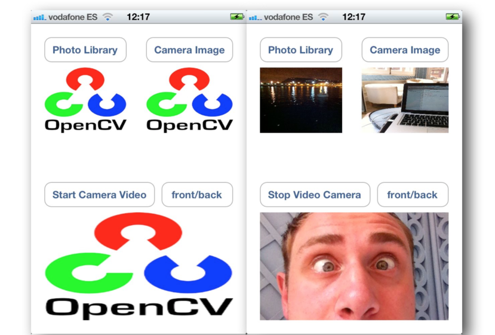
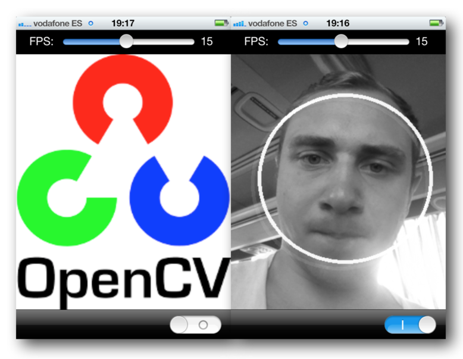
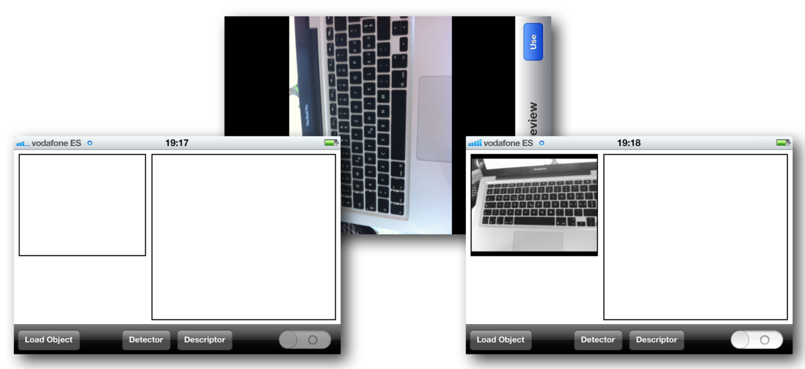
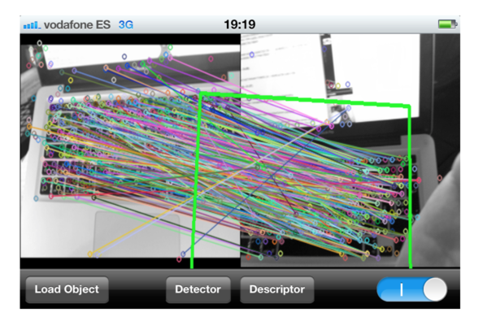
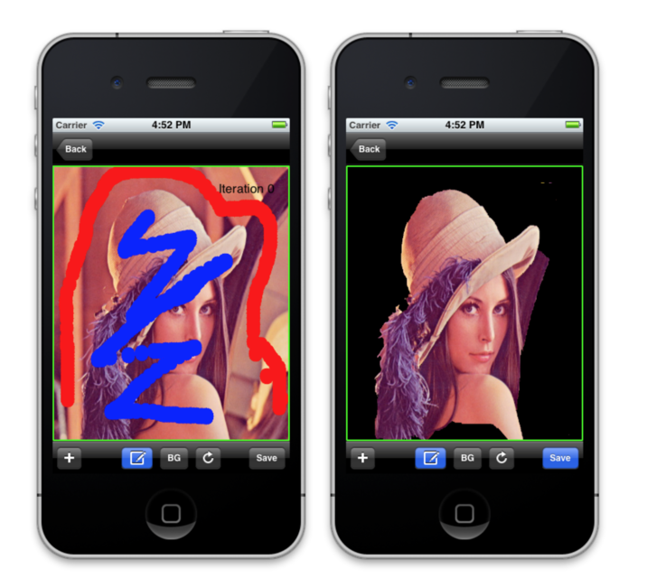
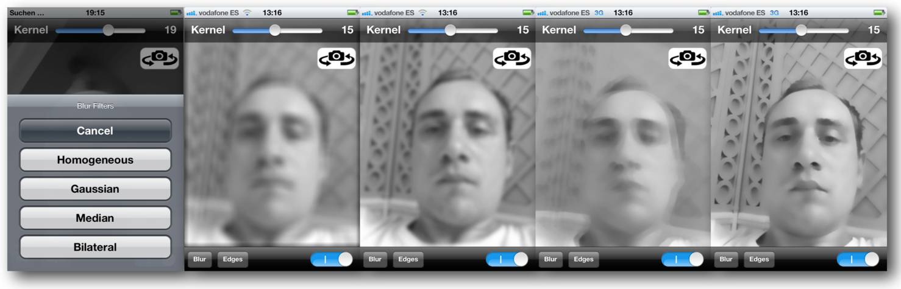
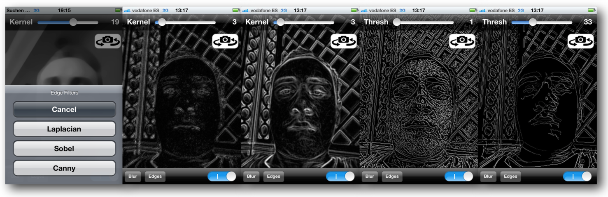
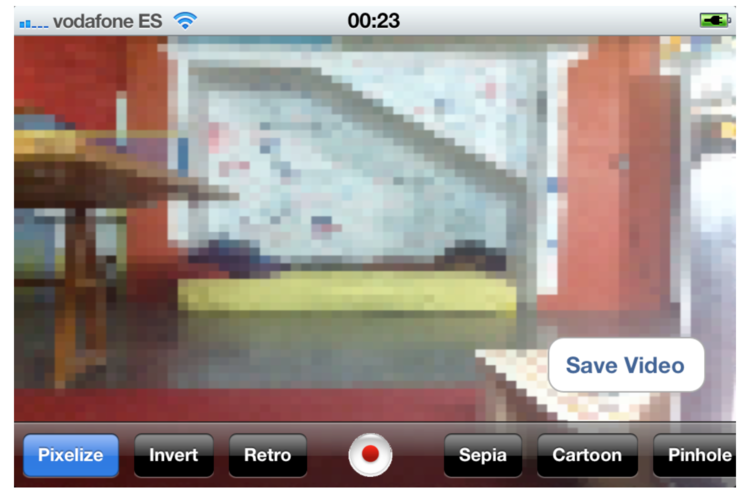

# Overview
----------

This repository contains iOS demo applications developed during Google Summer of Code 2012 with opencv.org.

* HelloIosVideo: Beginners tutorial on using opencv's ios camera interface.

* FaceDetectVideo: Face detection on still images and iphone video camera.

* FindHomography: Planar object recognition on video input.

* GrabCut: Grabcut segmentation algorithm. Paint foreground/background seeds with touch gestures.

* VideoConvolution: Process video frames with basic convolution kernels: Gaussian blur, median blur, bilateral blur, laplacian, sobel, canny.

* VideoFilter: Advanced video filters: pixelation, color inversion, retro filter, soft focus, cartoon, pinhole.

